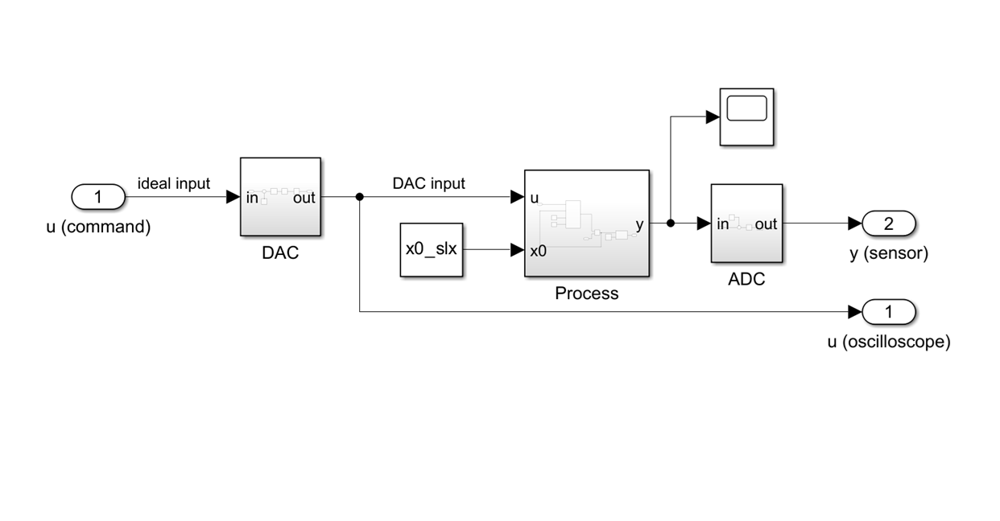

# Data-Driven Identification of a 2nd-Order Dynamic System

## Overview
This repository presents a data-driven approach to modeling and identifying a 2nd-order dynamic system with real poles (aperiodic damped regime). The objective is to analytically deduce the mathematical model (transfer function and state-space representation) using exclusively input-output data sets obtained from a step response.

This approach avoids "black-box" predefined functions in favor of an explicit mathematical implementation based on linearization and linear regression.

## Identification Methodology
The mathematical model is structured around three fundamental parameters that characterize the system's dynamics, all extracted from a single continuous experiment:

1. **Proportional Gain (K):** Determined by analyzing the system's steady-state behavior. The ratio between the output and input variations was calculated, and the values were averaged to mitigate the measurement noise induced by the ADC/DAC converters.
2. **Dominant Time Constant (T1):** Extracted by applying the natural logarithm to the transient response data. The slope of the resulting linearized region was determined using the Least Squares method (linear regression), and T1 was analytically deduced from this slope.
3. **Non-dominant Time Constant (T2):** Calculated by estimating the time of the inflection point on the step response curve. Using this temporal reference, T2 was extracted by numerically/graphically solving the specific transcendental equation of the system's response.

## Model Validation
To guarantee the accuracy of the identified model against the real physical process, validation was performed using two distinct approaches:
* **Transfer Function:** Ideal simulation, assuming zero initial conditions.
* **State-Space Representation:** Realistic simulation, configured with the non-zero initial conditions physically present in the system at the exact moment the step input was applied.

The model's performance was evaluated using the Normalized Mean Square Error (NMSE). Following parameter fine-tuning, the simulated response overlaid on the raw data achieved an NMSE of under 10%, confirming the robustness and high accuracy of the identification.

## Repository Structure & Usage
* `system_identification.m` - The main MATLAB script that handles the dataset, executes the linear regression algorithms, and calculates the system parameters.
* `dynamic_system.slx` - The Simulink model of the physical process used for data acquisition.

**How to run:**
To execute the algorithm, open `system_identification.m` in MATLAB and run the script. It will automatically call the Simulink model in the background to generate the raw dataset and plot the comparative validation graphs.
